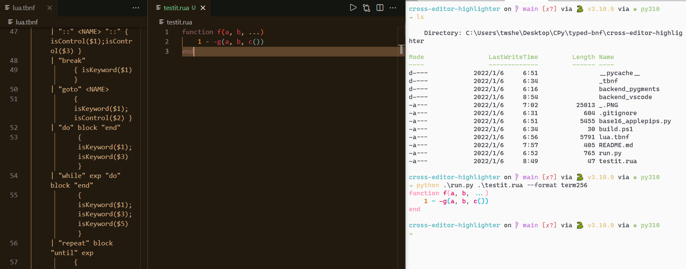

## Cross-editor contextual syntax highlighter via Typed BNF

Do you like "one grammar, syntax highlighters everywhere?"

喜欢我一个文法，到处高亮吗？

### build grammar for VScode

build: `tbnf  .\cross-editor-highlighter\lua.tbnf .\cross-editor-highlighter\backend_vscode\src "lua_sh" --backend typescript-antlr`

### build grammar for pygments

build: ` python .\runcli.py  .\cross-editor-highlighter\lua.tbnf .\cross-editor-highlighter\backend_pygments\ "lua_sh" --backend python-lark`
